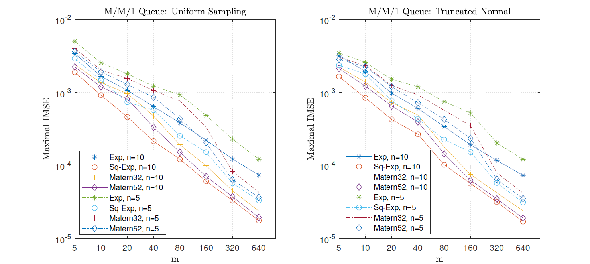
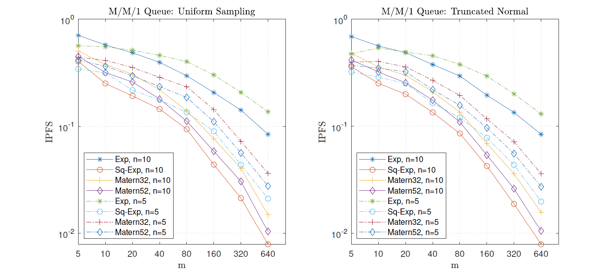

Overall, the scripts to obtain different figures are similar.

## Figures in manuscript
*   “**Figure 1**”: obtained by running "**scripts/d1/AdapMSE.m**" (main part: **Lines 23-35 and 163-264**)

.png)
.png)

*   “**Figure 2**”: obtained by running "**scripts/d1/AdapMSE2.m**" (main part: **Lines 23-35 and 164-268**)

.png)
.png)

*   “**Figure 3**”: obtained by running "**scripts/d3/Adap13D.m**" (main part: **Lines 23-35 and 73-174**)

.png)
.png)

*   “**Figure 4**”: obtained by running "**scripts/d10/Adap10D.m**" (main part: **Lines 22-35 and 164-257**)

.png)
.png)

*   “**Figures 5 and 6**”: obtained by running "**scripts/queue/manuscript/AdapQ.m**" 

## Figures in online supplement

*   Figure of **Online Supplement's Section 5.2 Case (i)**: obtained by running "**scripts/d1/AdapMSE.m**" (main part: **Lines 66-95 and 265-328**)

.png)
.png)

*   Figure of **Online Supplement's Section 5.2 Case (ii)**: obtained by running "**scripts/d1/AdapMSE.m**" (main part: **Lines 36-65 and 98-162**)

.png)
.png)

*   Figure of **Online Supplement's Section 5.2 Case (iii)**: obtained by running "**scripts/d2/Adap12D.m**" (main part: **Lines 38-67 and 73-140**)

.png)
.png)

*   Figure of **Online Supplement's Section 5.2 Case (iv)**: obtained by running "**scripts/d3/Adap13D.m**" (main part: **Lines 36-66 and 175-241**)

.png)
.png)

*   Figure of **Online Supplement's Section 5.2 Case (v)**: obtained by running "**scripts/d1/AdapMSE2.m**" (main part: **Lines 66-89 and 269-338**)

.png)
.png)

*   Figure of **Online Supplement's Section 5.2 Case (vi)**: obtained by running "**scripts/d1/AdapMSE2.m**" (main part: **Lines 36-65 and 93-160**)

.png)
.png)

*   Figure of **Online Supplement's Section 5.2 Case (vii)**: obtained by running "**scripts/d10/Adap10D.m**" (main part: **Lines 66-90 and 261-329**)

.png)
.png)

*   Figure of **Online Supplement's Section 5.2 Case (viii)**: obtained by running "**scripts/d10/Adap10D.m**" (main part: **Lines 36-65 and 93-161**)

.png)
.png)

## Table in online supplement

*   Table of **Online Supplement's Section 5.3**: obtained by running "**scripts/queue/online supplement/Queue_pred.m**"

